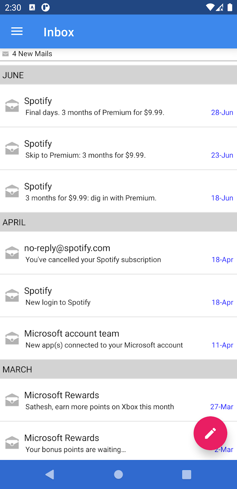

<h2 align="center"><b>Corporte Mail</b></h2>
<h4 align="center">Email client for a wide range of corporate companies using Microsoft Outlook.</h4>

## Corporate Mail
This android app is an email client for the Microsoft Outlook server. The code is clean without the lot of bloatware found in other similar apps found in the play store.

## Features:
✓ Lightning fast  
✓ Secure Email  
✓ No external servers involved

## Build
Follow these instructions to build and run the project.

1. Clone this repository.
2. Install [Android Studio](https://developer.android.com/studio) or Intelliji Idea Ultimate.
3. Import the project. Open Android Studio, click Open an existing Android Studio project and select the project. Gradle will build the project.
4. Run the app. Click Run > Run 'app'. After the project builds you'll be prompted to build or launch an emulator.

## Screenshots

   
   
   

## Contributing Guidelines
Read the contributing guidelines [here](CONTRIBUTING.md)